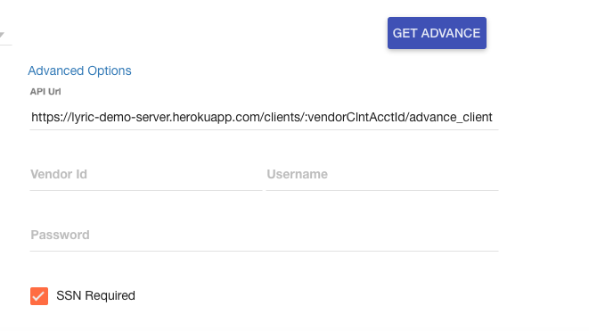

## Congratulations
If you're reading this, you probably just deployed your own demo server. There are two steps to making this work.

  - Setup environment variables
  - Update the API url in the demo app

### Environment Variables
The vendorId, username and password are used for both the client and server demo.  These values are
stored as environment variables.  These values can be overridden in both demos by setting the values
in the Advanced Options section.

    DEFAULT_VENDOR_ID
    DEFAULT_USERNAME
    DEFAULT_PASSWORD

### API URL

Find your new Heroku app URL and update this advance setting and the demo apps will start working with your new demo server.

Return to [Integration Guides](https://github.com/LyricFinancial/integration-guides#4-save-the-membertoken-that-gets-returned)